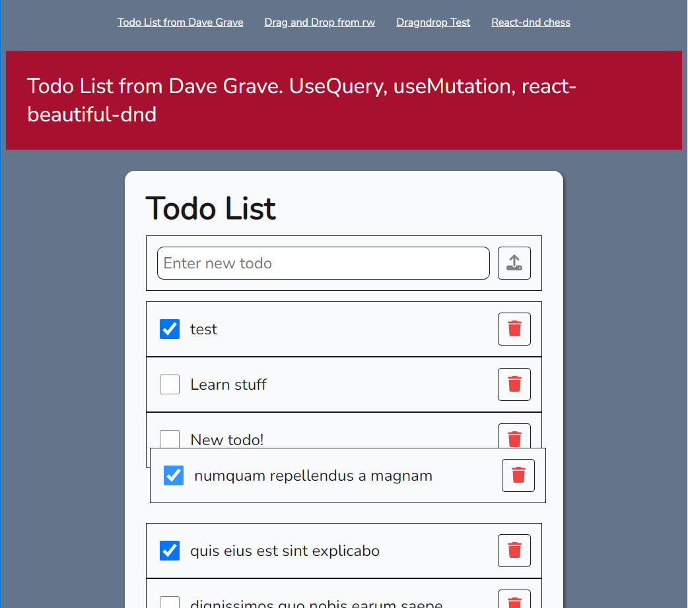
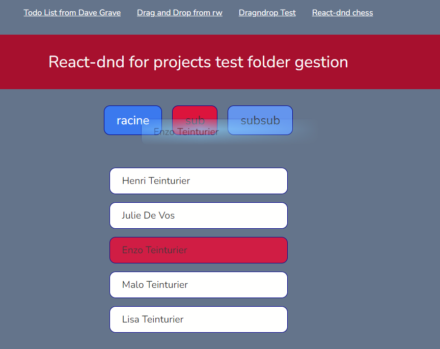
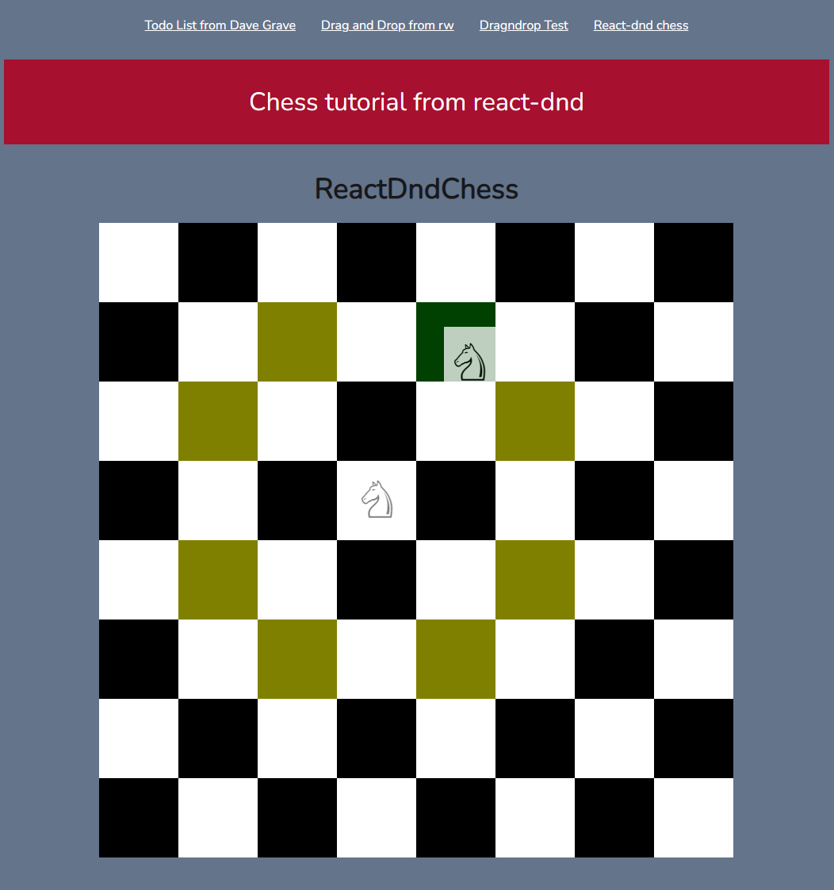

# initialisation

Pour initialiser le projet nous devons lancer notre serveur json sur le port 3500

```
 json-server -w data/db.json -p 3500
```

pour pouvoir lancer le serveur il faut installer json-server

```
// installation globale:
npm i json-server -g
// lancer le serveur sans installation prealable.
npx json-server -w data/db.json -p 3500
```

<table>
  <tr>
    <td valign="top" align="center">
      <strong>React-Beautiful & useQuery</strong><br>
      <a href="src/pictures/reactBeautiful&useQuery.png" target="_blank">
        
      </a>
    </td>
    <td valign="top" align="center">
      <strong>React-Dnd change folder Item</strong><br>
      <a href="src/pictures/reactDndChangeFolder.png" target="_blank">
        
      </a>
    </td>
    <td valign="top" align="center">
      <strong>React-Dnd Tuto Chess</strong><br>
      <a href="src/pictures/reactDndTutoChess.png" target="_blank">
        
      </a>
    </td>
  </tr>
</table>
